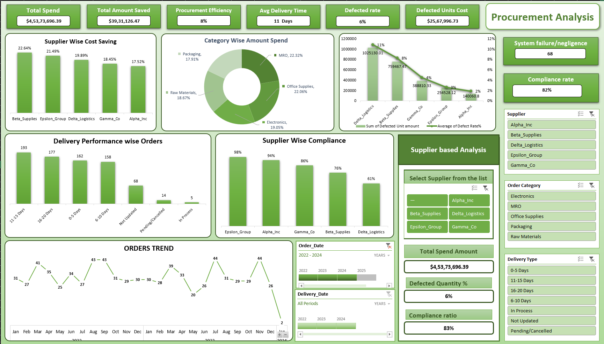

# Procurement & Supply Chain Analytics

## Project Goal

Developed an end-to-end automated data pipeline to make **procurement spend, supply chain bottlenecks, and vendor compliance transparent**, allowing executives to interactively analyze market positioning and operational efficiency.

The project emphasizes that **robust data extraction and optimization-first preprocessing drive actionable business insights**, highlighting the importance of structured data engineering alongside executive-level business intelligence visualization.

## Dashboard Preview

Below is a live look at the dashboard built for this project featuring the custom supply-chain green theme:



---

## Technical Core

* **Automated Data Acquisition:** Dynamically targets and extracts raw purchasing logs by establishing a live folder connection to unstructured CSV files, eliminating manual data entry.
* **Advanced Feature Engineering & Cleaning:** Techniques include Power Query (M-Code) transformations to strip leading/trailing whitespaces, force strict currency data types, and standardize mixed text-based date strings into calculable dates.
* **Targeted Imputation & Logic Gates:** Handled missing delivery dates (`Null` values) by engineering nested `IFS` statements to categorize open orders into actionable statuses ("Valid Open", "In Progress", or "Not Updated") rather than letting blank cells break the calculations. 
* **Standardization:** Converted text-based compliance strings ("Yes"/"No") into binary flags (1/0) to enable accurate mathematical averaging for vendor risk scores.
* **Task-Aware Analytics Dashboard:** Interface built with complex Excel logic and an "Invisible Bridge" architecture using hidden Pivot Tables and `XLOOKUP` to simulate web-like interactive slicer buttons.
* **Real-Time Evaluation & Visualization:** Delivers high-level market KPIs (Procurement Efficiency %, Defected Rate, Average Delivery Time) and utilizes summarized matrices to extract density metrics like Vendor Scorecards.

---

## Key Formulas & Logic

The dashboard relies on several advanced formulas to enable dynamic interactions and granular market insights. They are categorized below:

### 1. Core Aggregations & KPIs

```excel
Total Amount Saved = ([Quantity] * [Unit_Price]) - [Spend]

Defect Rate = IFERROR(Defective_Units / Quantity, 0)

Compliance Score = IF([@Compliance]="Yes", 1, 0)

```

### 2. Advanced Supply Chain Status Logic (Handling Nulls)

```excel
Delivery_Status = IFS(
    AND(ISBLANK([@Delivery_Date]), OR([@Status]="Pending", [@Status]="Cancelled")), "Valid Open",
    AND(ISBLANK([@Delivery_Date]), [@Status]="Partial Delivered"), "In Progress",
    AND(ISBLANK([@Delivery_Date]), [@Status]="Delivered"), "Not Updated",
    TRUE, [@Delivery_Date] - [@Order_Date]
)

```

### 3. Dynamic UI Filtering ("Invisible Bridge" Architecture)

```excel
Dynamic_Card_Output = 
XLOOKUP(
    Bridge_Sheet!$P$2, 
    Clean_Data[Supplier_Name], 
    Clean_Data[Compliance_Score], 
    "Vendor Not Found", 
    0, 
    1
)

```

---

## Key Performance Metrics

The dashboard provides side-by-side comparisons of vendors, categories, and delivery types, enabling users to identify which suppliers drive value and which cause financial leakage.

* **Market Overview:** $4.53M Total Spend, $3.9M Total Amount Saved, and an 82% overall compliance rate.
* **Pricing & Efficiency:** Discovered an 8% overall procurement efficiency, but revealed a massive discrepancy where Tech Hardware yielded high savings while Raw Materials yielded almost zero.
* **Vendor Risk Assessment:** Isolated specific liabilities, such as Delta Logistics, tracking their specific contribution to the $2.5M Defected Units Cost.

---

## Repository Structure

The files are organized into logical groups to separate raw data and production dashboards.

```text
Procurement-Analytics-Project/
├── Raw_Data/                               <-- Folder containing the unstructured CSV files
│   └── PO_Records_2022_2024.csv          
├── Procurement_Analysis_Dashboard.xlsx     <-- Interactive Dashboard (with Power Query backend)
├── not_updated_Procurement_dashboard.pptx  <-- Executive Case Study Presentation
└── README.md                               <-- Documentation

```

### How to Run the Project

1. **Extract Data:** Download the `Raw_Data` folder and place it on your local machine.
2. **Re-link Pipeline:** Open `Procurement_Analysis_Dashboard.xlsx`. Go to Data > Get Data > Data Source Settings, and change the source path to point to your downloaded `Raw_Data` folder.
3. **Clean & Transform:** Click "Refresh All" on the Data ribbon. Power Query will automatically execute the M-Code cleaning scripts and update the data model.
4. **Explore Dashboard:** Use the styled slicer buttons on the right-hand panel to dynamically filter the Vendor Scorecards and KPIs.

```
